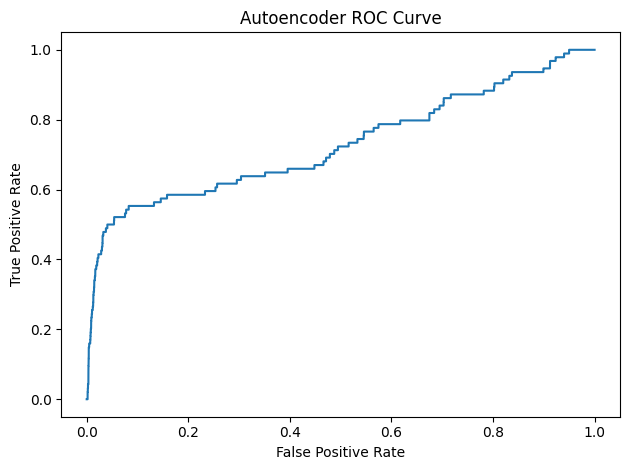
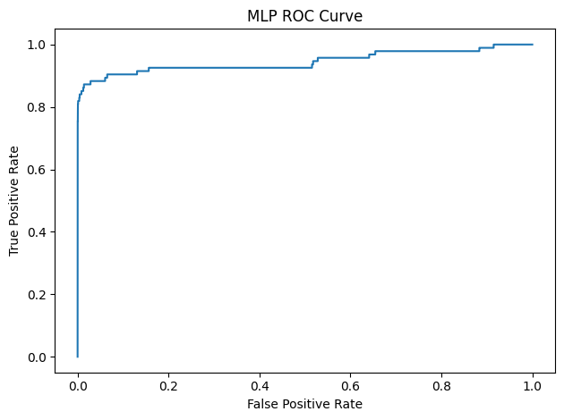

# Which model best detects credit card fraud?

This project explores how different machine learning models can help detect credit card fraud, a costly problem for banks and customers.  

I experimented with both unsupervised and supervised techniques to spot fraudulent transactions based on transformed features and a binary target variable (0 = non-fraudulent, 1 = fraudulent).

## Explore Approaches

### Unsupervised learning

- **Isolation Forest**: detects outliers by making random splits and isolating anomalies
- **Autoencoder**: learns to reconstruct normal transactions and flags anomalies with reconstruction loss.

### Supervised learning

- **Random Forest**: tested on original features, features combined with anomaly scores, and autoencoder embeddings.
- **Multilayer Perceptron (MLP)**: the trained neural network has a simple architecture.

## Results

- **Best unsupervised model**: Autoencoder (AUC = 0.73)
- **Best supervised model**: MLP (AUC = 0.95)

Autoencoder had quite quite impressive performance, given that it does not require labels. This is efficient in real-life cases as well, when labeled data is absent. When labels are available, supervised learning models are far more effective at catching fraud.

## Visual Results

## Future Work

An interesting next step would be to explore more systematic hyperparameter tuning, which may further improve the models' performance .

---

